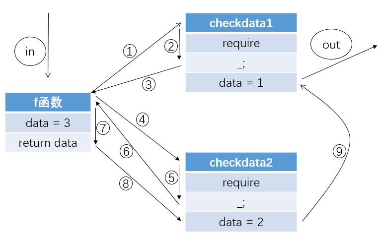

# 三、Solidity中的函数关键字
Solidity中有很多关键字，可以修饰函数的如`internal`、`external`、`payable`等，可以同时修饰函数和状态变量的如`public`、`private`，还有可以修饰变量的如`memory`、`storage`等，函数的声明部分可加关键字如下所示：
```javascript
function (<parameter types>) [private|public|internal|external][modifier][pure|constant|view|payable] [returns (<return types>)]
```
本文就来介绍一下这些关键字。
## 1. 函数可见性定义符
函数的可见性类型有四种：`external`、`internal`、`public`和`private`。
### 1.1 external
`external`修饰的函数是外部函数，外部函数是合约接口的一部分，这意味着这类函数可以被其他合约调用，也可以通过transactions调用。

外部函数不能被内部调用，如：
```javascript
contract f{
    function a() external returns (uint){
        return 5;
    }
    
    function b() public returns (uint){
        return a();
    }
}
```
此时编译合约会报错，无法找到函数`a()`，需要将`b()`函数改成以下这样：
```javascript
	function b() public returns (uint){
        return this.a();
    }
```
外部函数一般用于给其他合约提供接口以查询或操作本合约数据，外部账户可通过transaction调用合约的外部函数来存取合约中的数据。
### 1.2 public
`public`修饰的函数是公共函数，也是合约接口的一部分，可以通过内部调用和transaction调用。
对于public状态变量，编译器会自动创建所有public状态变量的Getter函数，例如：
```javascript
contract f{
    uint public data;
}
```
会自动生成一个供外部查询`data`的函数。
```javascript
	function data() returns (uint){
		return data;
	}
```
从外部访问`data`时会被当作函数形式，从内部访问时为状态变量的形式，如以下测试合约：
```javascript
contract f{
    uint public data = 10;
}
contract g is f{
	function getData() returns (uint){
		return data;
	}
}
contract h{
	function checkFdata() returns (uint){
		f F = new f();
		return F.data();
	}	
}
```
`g`是继承了`f`的合约，访问`data`时为内部访问，`h`合约访问`data`时为外部访问。
复杂一点的公共状态变量如结构体和映射：
```javascript
contract complex {
    struct Data { 
	    uint a; 
	    bool b; 
	}
    mapping(uint => mapping(bool => Data[])) public data;
}
```
会自动生成以下函数供外部访问data中的数据：
```javascript
	function data(
		uint arg1, 
		bool arg2, 
		uint arg3
	) returns (uint a, bool b){
		a = data[arg1][arg2][arg3].a;
		b = data[arg1][arg2][arg3].b;
	}
```
### 1.3 internal
`internal`修饰的函数是内部函数，这些函数的功能只能在内部进行访问，此合约的所有子合约也可以访问。约定俗成地，内部函数名前会加上`_`。使用上，一般会在内部函数中修改合约中的数据，并在外部函数或其他内部函数中被调用，如下为crytokitties合约中的部分代码：
```javascript
	//_transfer用于完成kitty属权转移操作
    function _transfer(address _from, address _to, uint256 _tokenId) internal {
        ownershipTokenCount[_to]++;
        kittyIndexToOwner[_tokenId] = _to;
        if (_from != address(0)) {
            ownershipTokenCount[_from]--;
            delete sireAllowedToAddress[_tokenId];
            delete kittyIndexToApproved[_tokenId];
        }
        Transfer(_from, _to, _tokenId);
    }
    …………
    //bid用于给拍卖中的kitty出价
    //通过两个内部函数完成一次成功拍卖购入kitty的操作
    function bid(uint256 _tokenId)
        external
        payable
        whenNotPaused
    {
        _bid(_tokenId, msg.value);
        _transfer(msg.sender, _tokenId);
    }
```
### 1.4 private
private修饰的状态变量或函数只有当前合约可见，外部及衍生合约都不可见。
***
## 2. view和pure
`view`和`pure`可置于与可见性类型相同的位置上，声明了`view`的函数相当于承诺本函数不会修改合约状态，只进行读数据的操作；声明了`pure`的函数承诺本函数不从状态中读取数据也不会修改数据。
### 2.1 view
首先，以下八种操作是有可能改变合约状态或者世界状态的操作：
1. 修改合约状态变量
2. 触发一个事件
3. 创建一个新的合约
4. 使用了合约自毁函数selfdestruct
5. 通过调用发送以太币
6. 调用其他没有标识为`view`或`pure`的函数
7. 使用底层调用
8. 使用了包含特定操作码的内联汇编

因此，如果将某函数标识为`view`后应避免进行这八种操作。需要查询合约数据时，可以通过调用标识为`view`的外部接口函数（前提是这个函数中确实没有涉及上述八种操作，因为编译时以太坊不会硬性检查`view`函数是否遵循了规则），因为这个查询过程可以不需要矿工验证，因此函数执行可以不消耗gas。如cryptokitties中设置了类似于以下的函数来查询kitty的属性：
```javascript
    function isPregnant(uint256 _kittyId)
        public
        view
        returns (bool)
    {
        require(_kittyId > 0);
        return kitties[_kittyId].siringWithId != 0;
    }
```
###2.2 pure
`pure`修饰的函数更为严格，不读取也不修改状态。修改状态的操作在`view`部分已经讲到，以下五种操作是涉及读取状态的操作：
1. 读状态变量
2. 访问`address(this).balance`或`<address>.balance`
3. 访问`block`、`tx`、`msg`的成员变量（`msg.sig`和`msg.data`例外）
4. 调用非`pure`函数
5. 使用了包含特定操作码的内联汇编

可以这样理解，`pure`函数就是只使用了函数的传入参数，并返回了只由传入参数计算得到的值，如以下函数为例：
```javascript
    function _computeCurrentPrice(
        uint256 _startingPrice,
        uint256 _endingPrice,
        uint256 _duration,
        uint256 _secondsPassed
    )
        internal
        pure
        returns (uint256)
    {
        if (_secondsPassed >= _duration) {
	        return _endingPrice;
	    } else {
		    int256 totalPriceChange = int256(_endingPrice) - int256(_startingPrice);
		    int256 currentPriceChange = totalPriceChange * int256(_secondsPassed) / int256(_duration);
	        int256 currentPrice = int256(_startingPrice) + currentPriceChange;		
            return uint256(currentPrice);
        }
    }
```  
这个函数整个计算过程和返回值都是由4个传入参数计算而来，三个`int256`也因为是局部变量，不会存储在合约的`storage`中，因此不会改变合约状态。    

> 注：还有一个关键字constant，在v0.4.17版本后，constant拆成了view和pure，view的作用和constant完全一致，因此在这里不特别解释。

***
##3. payable
`payable`和`pure`、`view`关键字属于同一位置的关键字，三者在一个函数声明都只能出现其中一个。

`payable`修饰函数为可支付函数。如果一个函数需要进行货币操作，必须要带上`payable`关键字，否则调用函数并传入货币时会报错。传入货币后，货币会加入到传入地址的`balance`中。
以下例子展示了如何给`payable`函数传入货币：
```javascript
contract Receiver{
    uint256 data;
    //通过以下这个函数给Receiver合约发送以太币
    function receiveEther(uint256 x) payable returns (uint256){
        data = x;
        return msg.value;
    }
    
    function getBalance() returns (uint256){
        return this.balance;
    }
}

contract Sender{
    Receiver rec;
    function Sender() payable{        
    }
    
    function createF(){
        rec = new Receiver();
    }
    
    //这里是发送以太币的操作
    function sendEther(uint256 amount){
        rec.receiveEther.value(amount)(10);
    }

    function getBalance() returns (uint256){
        return this.balance;
    }
}
```
另外，在上一篇文章中讲到了`send`和`transfer`会调用合约的`fallback`函数，没有实现`fallback`函数的合约会把`send`和`transfer`发送的以太币返还，如果`fallback`函数没有加上`payable`关键字也会导致以太币发送出错。因此如果希望合约正常接收以太币，可以像以下这个例子实现`fallback`函数：
```javascript
	function() payable{
	}
```
可以设置成正常接收以太币，当然也可以设置成拒绝接收以太币。`crytokitties`合约中就设置了以下这样的`fallback`函数来限定只有拍卖合约可以给本合约发送以太币，来防止玩家误操作：
```javascript
    function() external payable {
        require(
        //saleAuction和siringAuction是两个拍卖合约的实例
            msg.sender == address(saleAuction) ||
            msg.sender == address(siringAuction)
        );
    }
```
***
## 4. modifier函数修改器
修改器（modifier）可以用来改变一个函数的行为，例如在函数执行前先检查某个前置条件。`modifier`还是一种合约属性，可以被子合约继承，还可以被派生的合约重写（override）。
首先来看以下这个简单的例子：
```javascript
contract f{
    modifier checkData(uint256 x){
        require(x != 0);
        _;
    }
    
    function abc(uint256 x) checkData(x) returns (bool){
        return true;
    }
}
```
例子中，`checkData()`是一个函数修改器，可以放置在函数修饰词的位置，这样在函数`abc()`执行前，首先要在`checkData()`中判断前置条件是否成立。

`require(x != 0)`在Solidity中相当于`if (x != 0){}`，区别在于前者不成立会直接抛出错误并终止执行，后者会跳过`if`代码块继续执行。

`_;`代表返回原函数的位置。由于`modifier`类关键字在函数声明时可以加很多个，在这里用以下这个例子来解释其中运行的顺序：
```javascript
contract Modify{
    uint256 public data;
    
    modifier checkdata1(uint256 x){
        require(x != 0);
        _;
        data = 1;
    }
    
    modifier checkdata2(uint256 x){
        require(x != 0);
        _;
        data = 2;
    }
    
    function f(uint256 x) checkdata1(x) checkdata2(x) returns (uint256){
        data = 3;
        return data;
    }
}
```
`f`函数添加了两个`modifier`关键字`checkdata1`和`checkdata2`，都会对传入参数`x`进行值判断，且都会在`_;`后对`data`进行修改，其中的运行顺序如下图所示：


在`return data`语句执行后，函数并不会立即返回，而是在内存中保留一个匿名的变量保存data的值。然后会跳转回`_;`，继续执行后面的语句。先执行`checkdata2`的，再执行`checkdata1`的。执行完后才会对调用者返回刚才保存在匿名变量中的值`3`，`data`会在中间修改为`data = 2`，最后再修改为`data = 1`。

`modifier`还可以用于检查函数调用权限，如经常被其他合约继承的`Owable`合约：
```javascript
contract Ownable {
  address public owner;

  function Ownable() {
    owner = msg.sender;
  }

  modifier onlyOwner() {
    require(msg.sender == owner);
    _;
  }

  function transferOwnership(address newOwner) onlyOwner {
    if (newOwner != address(0)) {
      owner = newOwner;
    }
  }
}
```
在继承了该合约的其它合约中，函数声明上加上`onlyOwner`关键字，可以确保只有规定的地址`owner`可调用该函数，其他地址无法访问。通过这样的方式，在合约中可以设定一些关键角色的地址，和定义一些只有关键角色能进行的操作，来在一定程度上控制这个合约。
***
下一篇文章中将会讲数据的存储位置，`memory`、`storage`和`calldata`。