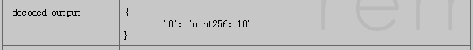

# 五、合约间调用
根据以太坊的说明，外部账户可以创建和调用合约，合约账户也可以创建和调用其他合约，接下来会根据一些实例研究合约间如何进行互相调用。

## 1. 合约调用已部署合约
首先以**cryptokitties**为例。**cryptokitties**是以太坊上很火爆的一款游戏，中文名为加密猫。在这款游戏的代码中，一共有十多个合约，通过一层层的继承，最后最底层继承了所有合约功能的实际上只有三个，这三个合约现在也被部署在了以太坊上。
1. KittyCore
2. SaleClockAuction
3. SiringClockAuction

对加密猫代码的具体分析会在下一篇文章中讲到。

`KittyCore`是最核心的合约，在`KittyCore`中实现了`SaleClockAuction`和`SiringClockAuction`两个合约的实例，接下来看看代码中是如何调用这两个合约中的功能的：
```javascript
contract Kitty{
    SaleClockAuction public saleAuction;
    SiringClockAuction public siringAuction;
	
    function setSaleAuctionAddress(address _address) external onlyCEO {
        SaleClockAuction candidateContract = SaleClockAuction(_address);
        require(candidateContract.isSaleClockAuction());
        saleAuction = candidateContract;
    }
    
    function setSiringAuctionAddress(address _address) external onlyCEO {
        SiringClockAuction candidateContract = SiringClockAuction(_address);
        require(candidateContract.isSiringClockAuction());
        siringAuction = candidateContract;
    }
    …………
}
```
两个状态变量`saleAuction`和`siringAuction`实际上是地址类型。对这两个变量赋一个地址值，地址值为部署在区块链上的另一合约的地址时，这两个变量就会成为链上合约的实例，就可以通过这两个实例变量调用对应合约中提供的`public`或`external`函数。

以下是这种调用方式的简化实例，首先在链上部署合约`f`：
```javascript
// f.sol
//这里假设f合约部署后地址为0xc7b6ff94b523d6c5a042764581d6c32df43c80a5
contract f{
    uint256 private data = 10;
    function getData() public returns (uint256){
	return data;
    }

    function setData(uint256 x) public {
	data = x;
    }
}
```
在即将要部署的`g`合约.sol文件中加入合约`f`的接口信息：
```javascript
// g.sol
contract f{
    function getData() public returns (uint256);
}

contract g{
    f contractTest;
    //将上面f合约的地址0xc7b6ff94b523d6c5a042764581d6c32df43c80a5传入
    function setAddr(address x) external{
        contractTest = f(x);
    }
//  接口中没有声明该函数，编译会出错
//  function setData(uint256 x){
//	contractTest.setData(x);	
//  }
	
    function getData() external returns (uint256){
        return contractTest.getData();
    }    
}
```
接着部署`g`合约。首先调用`setAddr()`将`f`合约的地址传入，然后就可以通过`f`合约在`g`合约中的实例`F`来调用`f`合约中的`getData()`函数。
> 有两点需要特别说明：
> * `f`合约接口中没有声明的函数，在`g`合约中无法被调用，即使链上的`f`合约有这个函数。
> * 接口中的函数声明可以带有实现，但是实际执行中会无视接口中的实现（按照规定，接口中的函数不能带有实现）。

总结一下，知道以下两点就可以在合约中调用另一已部署合约。：
1. 被调用合约地址
2. 被调用合约abi接口

***
## 2. 合约创建合约
在这个场景下，已部署合约通过一些方法，可以创建出一些新的合约。新合约和创建者合约在区块链上处于同等的地位，只要知道新合约的地址，其他账户也可以调用新合约中的函数。
以下是一个合约创建合约的例子：
```javascript
//此时两个合约代码在同一个文件FAndG.sol中
contract f{
    uint256 private data;
    event BeCreated(uint256 data);
    
    function f(uint256 x) public payable{
        setData(x);
        BeCreated(data);
    }
    
    function getData() public returns (uint256){
        return data;
    }
    
    
    function setData(uint256 x) public {
        data = x;
    }
    
    function getBalance() external returns (uint256){
        return this.balance;
    }
}

contract g{
    f createContract;
    
    function g() public payable{
        
    }
    //创建出一个新的f合约，并返回新合约的地址
    function createF1(uint256 x) external returns (address){
        createContract = new f(x);
        return createContract;
    }
    
    //在创建新的f合约的同时，对f合约的构造函数发送以太币
    function createF2(uint256 x) external returns (address){
        return (new f).value(10)(x);
    }
    
    function getBalance() external returns (uint256){
        return this.balance;
    }
}
```
直接部署`contract g`，通过调用函数`createF1()`可以在区块链上部署一个新的合约`f`，`createContract`变量是`g`合约上`f`的实例。

函数`createF2()`也是在链上部署新合约的函数，区别在于演示了部署一个新合约并在新合约创建时就转入10Wei的操作，前提是新合约的构造函数加上了`payable`关键字。返回得到新合约地址，调用新合约`f`中的函数`getBalance()`返回得到以下结果，说明以太币转入成功（前提是合约`g`中余额足够，否则执行会报错）。
 


>总结一下，一个合约想要能够创建部署一个新的合约，需要知道新合约的全部代码。

***
## 3. 合约调用中涉及的全局变量
通过某些以太坊定义好的全局变量，被调用合约可以得到调用者的以下信息：
> * `msg.sender`，保存了调用者的地址
> * `msg.data (bytes)`，保存了调用者传入参数信息
> * `msg.sig (bytes4)`，保存了调用者的签名信息
> * `msg.value`，保存了调用者传入的以太币数量
> * `gasleft()`，返回当前gas剩余量

特殊说明，当外部账户调用合约A，合约A再调用合约B，此时合约B收到的`msg.sender`是合约A的地址。如果合约B想获取发起交易的外部账户的地址，可以用`tx.origin`。
***
## 4.重入（Reentrancy）
重入是合约间调用时可能存在的漏洞，“重入”也可以理解为“递归”。由于在以太坊中有gas消耗的概念，因此恶意调用无限递归在以太坊中并不能实现，最终会因gas消耗完而退出执行。合约间的无限调用如以下这个合约所示：
```javascript
contract f{
    g G;    
    function setAddr(address x) public{
        G = g(x);
    }
    
    function circle() public{
        G.circle();
    }
}

contract g{
    f F;
    function setAddr(address x) public {
        F = f(x);
    }
    
    function circle() public{
        F.circle();
    }
}
```
首先分别部署`f`合约和`g`合约，得到两个合约的地址，通过`setAddr()`函数在各自合约中实现对方的实例，此时，这两个合约账户之外的其他账户调用`circle()`函数，就会进入无限递归直至设定的gas用完。

重入漏洞有可能造成重大的损失，当年著名的DAO事件就跟重入漏洞有关，感兴趣的可以自行搜索。
***
> 注：
> 还有第三种合约调用的方式，可以直接指定地址而不用实现实例，但是也需要知道被调用合约的abi接口，利用`call`调用来实现。

下一篇将应用之前讲过的对CryptokKitties合约代码进行分析。
