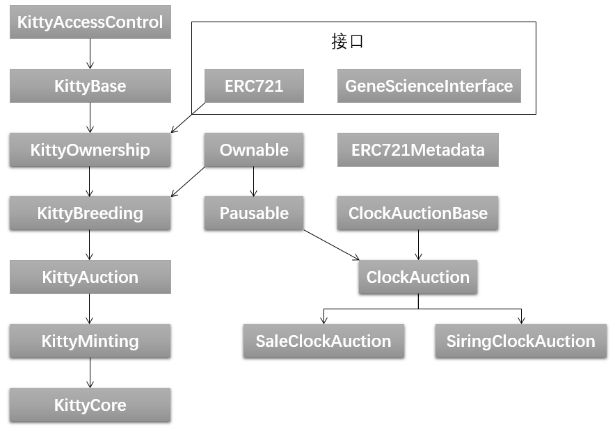

# 六、CryptoKitties合约代码分析
CryptoKitties中文名加密猫，一个部署在区块链上的DApp，是代币标准ERC-721的第一个实现应用，巅峰时期甚至还搞崩过以太坊。

[具体代码点击这里可以查看](https://etherscan.io/address/0x06012c8cf97bead5deae237070f9587f8e7a266d#code)

官网在这里：[加密猫官网](https://www.cryptokitties.co/)	想看看这些猫长啥样、拍卖行怎么运作的可以点进去查看

合约中需要了解的前置知识在先前的几篇文章中基本都讲过了，这里再补充一个合约继承的问题，直接看下面这个例子：
```javascript
contract a{
    Variable_1;
    Variable_2;
    function …… internal{}
    function …… external{}
}

contract b is a{
    Variable_3 private;
    function …… public {}
}
contract c is b{
}
```
例子中，合约`b`继承了合约`a`，合约`c`又继承了合约`b`，这样，合约`c`就相当于拥有了合约`a`和`b`的所有变量和函数，甚至包括了私有（`private`）的变量和函数，只不过这类私有的变量和函数只能通过对应合约中的函数（`internal`或`public`或`external`（只限外部））来调用。加密猫的合约涉及了多级继承以及多继承，规则和上述是一样的。

以下开始对合约代码进行分析。
## 1. 合约继承结构
加密猫文件中共有14个合约（contract）和2个接口，用下图表示其中的继承路径：

可以看到，按照刚刚说了一下的继承规则，处于最底层的合约一共有三个：`KittyCore`、`SaleClockAuction`和`SiringClockAuction`,部署了这三个合约其实就相当于部署了所有需要的功能。
> 几个特别说明的合约：
> 1. `ERC721`和`ERC721Metadata`是指ERC721标准实现，这个标准简单地说就是规定代币是非同质化的，每个代币独一无二不可拆分，并提供了一些代币操作的接口函数，想了解更多关于ERC721的信息可以自行搜索
> 2. `GeneScienceInterface`是一个已部署的链上的合约的接口，该合约会根据一些信息生成新猫的基因，调用方法在第五篇文章中讲过

***
## 2. 主合约分析
合约中大部分函数名、变量名包括合约名都是可以顾名思义的，这一段主要是讲从`KittyAccessControl`到`KittyCore`这一条线的逻辑。
> 下面不会将源代码原封不动放上来，大多时候只会有函数的声明部分

### 2.1 KittyAccessControl

通过设定三个管理层角色，三个角色分别对应三个地址，为合约添加了权限控制。
```javascript
    //CEO权限最大，可设置三个角色的地址和开启合约功能
    address public ceoAddress;
    //CFO管财政，卖出去的猫收到的以太币最终会转入CFO的地址中
    address public cfoAddress;
    //COO管发行，打折猫和初代猫由COO控制发出
    address public cooAddress;
    
    //四个函数权限控制修改器
    modifier onlyCEO() 
    modifier onlyCEO() 
    modifier onlyCEO() 
    modifier onlyCLevel() {
        require(
            msg.sender == cooAddress ||
            msg.sender == ceoAddress ||
            msg.sender == cfoAddress
        );
        _;
    }
    
    //三个设置管理层地址的函数，只能由CEO指定
    function setCEO(address _newCEO) external onlyCEO
    function setCFO(address _newCFO) external onlyCEO
    function setCOO(address _newCOO) external onlyCEO

    还有一些paused相关修改器和函数
```
paused相关修改器和函数用于冻结和解冻整个合约，这里就不写出来了。
### 2.2 KittyBase
合约中有以下几样基础设施：
1. 定义了结构体Kitty，记录一些必要的属性
2. 一些状态变量，保存需要用到的数据结构如数组和映射
3. 包含了创建猫和转移猫的内部调用操作
4. 包含了两个拍卖合约实例

Kitty结构体：
```javascript
    //具体的属性介绍可以查看源代码中的注释
    struct Kitty {
        uint256 genes;
        uint64 birthTime;
        uint64 cooldownEndBlock;
        uint32 matronId;
        uint32 sireId;
        uint32 siringWithId;
        uint16 cooldownIndex;
        uint16 generation;
    }
```
> `cooldown`属性特别说明，Kitty繁殖有冷却时间，每一次繁殖后冷却时间会改变，但都是确定的一段时间，通过计算下一次可繁殖区块号来标识Kitty当前是否可进行繁殖。冷却时间由相对应的冷却数组根据冷却等级`cooldownIndex`来确定，冷却等级在每次繁殖后增加，到达最高级时不再递增，对应冷却时间为7天。
```javascript
    uint32[14] public cooldowns = [
        uint32(1 minutes),
        uint32(2 minutes),
        uint32(5 minutes),
        uint32(10 minutes),
        uint32(30 minutes),
        uint32(1 hours),
        uint32(2 hours),
        uint32(4 hours),
        uint32(8 hours),
        uint32(16 hours),
        uint32(1 days),
        uint32(2 days),
        uint32(4 days),
        uint32(7 days)
    ];
```

状态变量：
```javascript
    //保存每一只猫的数组
    Kitty[] kitties;
    //猫ID映射到归属地址
    mapping (uint256 => address) public kittyIndexToOwner;
    //某地址拥有猫的数量
    mapping (address => uint256) ownershipTokenCount;
    //拍卖授权，和属权拍卖相关
    mapping (uint256 => address) public kittyIndexToApproved;
    //繁殖权授权，和繁殖拍卖相关
    mapping (uint256 => address) public sireAllowedToAddress;
    //调用拍卖合约的实例
    SaleClockAuction public saleAuction;
    SiringClockAuction public siringAuction;
```
创建猫和转移猫的操作，两个操作都是`internal`调用，这也是合约的结构之一，`internal`函数完成实际操作，`external`函数检测前置条件并调用`internal`函数完成操作。
```javascript
    function _transfer(address _from, address _to, uint256 _tokenId) internal{
	将代币从from地址转到to地址名下
    }
	
    function _createKitty(
        uint256 _matronId,
        uint256 _sireId,
        uint256 _generation,
        uint256 _genes,
        address _owner
    )
        internal
        returns (uint)
    {
        根据传入的Kitty属性
        创建出一个新的Kitty
        并加入到kitties数组中
    }
```
### 2.2 KittyOwnership
合约涉及到了实现ERC721标准的一些操作，还涉及了很多跟属权相关的函数操作，包括对内的和对外的。

以下是三个`internal`函数
```javascript
    function _owns(address _claimant, uint256 _tokenId) internal view returns (bool) {	    
	//归属检测
        return kittyIndexToOwner[_tokenId] == _claimant;
    }
    
    function _approvedFor(address _claimant, uint256 _tokenId) internal view returns (bool) {
	//授权检测
        return kittyIndexToApproved[_tokenId] == _claimant;
    }
    
    function _approve(uint256 _tokenId, address _approved) internal {
	//执行授权操作
        kittyIndexToApproved[_tokenId] = _approved;
    }
```
以下是两个`public`函数，内外都会用上
```javascript
    function balanceOf(address _owner) public view returns (uint256 count) {
	//返回某一地址代币数
        return ownershipTokenCount[_owner];
    }
    
    function totalSupply() public view returns (uint) {
	//返回总猫数
        return kitties.length - 1;
    }
```
以下是5个`external`函数，用于给其他账户操作或查询合约数据
```javascript
    function transfer(
        address _to,
        uint256 _tokenId
    )
        external
        whenNotPaused
    {
	提供给代币所有者完成代币转移操作
    }
    
    function approve(
        address _to,
        uint256 _tokenId
    )
        external
        whenNotPaused
    {
	提供给代币所有者完成代币转移权限授予操作
    }
    
    function transferFrom(
        address _from,
        address _to,
        uint256 _tokenId
    )
        external
        whenNotPaused
    {
	提供给获得授权人
	对代币进行属权转移操作
    }
    
    function ownerOf(uint256 _tokenId)
        external
        view
        returns (address owner)
    {
	根据代币ID查询对应所有者地址
    }
    
    function tokensOfOwner(address _owner) external view returns(uint256[] ownerTokens) {
	查询传入地址名下所有的代币ID
    }
```
### 2.3 KittyBreeding
合约中涉及了Kitty繁衍下一代的操作。

首先介绍一下繁衍到底是什么。在Kitty结构体中有两个字段，一个是`sireId`，一个是`matronId`，分别对应父母猫的ID（但是猫其实并没有分雄雌），实际点的说，父猫是卖出自己繁衍冷却的猫，母猫是买入别人繁衍冷却且拥有新猫的猫；父猫收到拍卖所得，母猫支出拍卖价和生育所需费用。

母猫从未繁殖到生育经过了两个步骤：1. 交配 2. 新猫出生。交配后将母猫的`sireWithId`字段改为父猫ID。

开头是三个状态变量，第一个规定了生成一个新Kitty需要固定2finney的资金，COO可设定这个默认的资金，第二个是统计怀孕猫数的，第三个是实现了基因合约`GeneScience`的实例，通过`setAddr`的方法调用另一部署在链上的合约，地址由CEO指定。
```javascript
    uint256 public autoBirthFee = 2 finney;
    function setAutoBirthFee(uint256 val) external onlyCOO {
        autoBirthFee = val;
    }
    
    uint256 public pregnantKitties;
    
    GeneScienceInterface public geneScience;
    function setGeneScienceAddress(address _address) external onlyCEO {
    }
```
接下来是两个`private`函数，说明都是给本合约的函数调用并返回条件判断结果
```javascript
    function _isValidMatingPair(
        Kitty storage _matron,
        uint256 _matronId,
        Kitty storage _sire,
        uint256 _sireId
    )
        private
        view
        returns(bool)
    {
	检测两只猫是否符合繁殖规则，规则有以下几条（规则有顺序性）：
	1.不是同一只猫
	2.一只猫不能是另一只猫的父母
	3.两只猫的父母不可有任何重叠
    }

    function _isReadyToGiveBirth(Kitty _matron) private view returns (bool) {
	检测是否符合生新猫的条件，有两条：
	1.sireWithId字段非0
	2.冷却时间已过
    }
```
5个`internal`函数
```javascript
    function _isReadyToBreed(Kitty _kit) internal view returns (bool) {
	检测是否符合交配的条件，有两条：
	1.sireWithId字段为0
	2.冷却时间已过
    }
    
    function _isSiringPermitted(uint256 _sireId, uint256 _matronId) internal view returns (bool) {
	检测父猫繁殖权是否已经授权给母猫所属地址
	同一地址的两只猫不需要授权
    }
    
    function _triggerCooldown(Kitty storage _kitten) internal {
	计算交配后的冷却时间
	每交配成功一次冷却等级+1
    }
    
    function _canBreedWithViaAuction(uint256 _matronId, uint256 _sireId)
        internal
        view
        returns (bool)
    {
	检测拍卖行上的父猫和母猫是否遵循繁衍规则
    }

    function _breedWith(uint256 _matronId, uint256 _sireId) internal {
	交配操作
	母猫siringWithId字段 = 父猫ID
	重置父母猫的冷却时间
	如果父母猫曾经授权某地址其交配权，则移除这个权利	    
    }
```
6个外部调用函数包括`public`。
前三个用于外部查询
```javascript
    function isReadyToBreed(uint256 _kittyId)
        public
        view
        returns (bool)
    {
	根据猫ID检测是否可交配
	调用了_isReadyToBreed
    }
    function isPregnant(uint256 _kittyId)
        public
        view
        returns (bool)
    {
	根据猫ID检测猫是否怀孕了
    }
    function canBreedWith(uint256 _matronId, uint256 _sireId)
        external
        view
        returns(bool)
    {
	检测两只猫是否满足交配规则
    }
```
后三个对数据进行操作
```javascript
    function approveSiring(address _addr, uint256 _sireId)
        external
        whenNotPaused
    {
	将父猫交配权授予_addr这个地址
    }
    
    function breedWithAuto(uint256 _matronId, uint256 _sireId)
        external
        payable
        whenNotPaused
    {
	在获得父猫授权后，母猫拥有者地址可以调用这个函数使母猫进入怀孕状态
	在这里会检测一系列条件
	最后调用_breedWith()完成交配操作
    }
    
    function giveBirth(uint256 _matronId)
        external
        whenNotPaused
        returns(uint256)
    {
	母猫怀孕后需要等待重置后的冷却时间到达才可以执行这一步
	换句话说，母猫在生育后可以即刻投入到下一次的交配中
	这一步由矿工调用，将此交易成功加入到区块链中的矿工可以获得设定好的2finney奖励
    }	
```
### 2.4 KittyMinting
这里我们先跳过了Auction合约，另外讲述，先看`KittyAuction`下面的两个合约。

这个合约用于发行最初的猫，发行权由COO控制。这里有两种可发行的猫，一种叫促销猫（PromoKitty），一种叫初代猫（Gen0Kitty），两者属性是基本一致的，不同点在于前者在创建时直接指定所有者地址，后者创建后的第一个所有者为本合约地址，并直接挂上拍卖进行出售。

首先看合约中的状态变量和常量：
```javascript
    //规定了两种猫的数量
    //促销猫最多5000只，初代猫最多45000只
    uint256 public constant PROMO_CREATION_LIMIT = 5000;
    uint256 public constant GEN0_CREATION_LIMIT = 45000;
    
    //规定了初代猫起拍价为10 finney，拍卖时间为一天
    uint256 public constant GEN0_STARTING_PRICE = 10 finney;
    uint256 public constant GEN0_AUCTION_DURATION = 1 days;
    
    //用于统计已经生成了多少只促销猫和初代猫
    uint256 public promoCreatedCount;
    uint256 public gen0CreatedCount;
```
接下来是两个生成促销猫和初代猫的函数，由COO控制：
```javascript
    function createPromoKitty(uint256 _genes, address _owner) external onlyCOO {
	_owner为直接指定的所有者
	没有的话会指定为COO地址    
    }
    function createGen0Auction(uint256 _genes) external onlyCOO {
	调用了_approve()将出售权授权给拍卖合约的地址	    
    }
```
最后还有一个计算下一个出代猫起始价的函数`_computeNextGen0Price()`。

计算的规则是这样的：上五个卖出的初代猫价格都会保存在`saleAuction`合约中，根据上五个卖出价的平均值*150%，得出这一次初代猫拍卖的起始价。

这里的拍卖和我们日常理解的拍卖有所不同，不是轮着出价比高价的制度，具体会在稍后讲解
### 2.5 KittyCore
该合约继承了上述的所有合约，游戏的具体操作逻辑在上面的合约中已经定义完了，这个合约主要负责对游戏进行管理而不是对数据进行管理。

首先定义了一个`newContractAddress`变量，用于在合约出现重大bug或升级时可以指定新合约地址，进行更新，由CEO进行控制。
```javascript
    address public newContractAddress;
    function setNewAddress(address _v2Address) external onlyCEO whenPaused {
    }
```
定义了合约的构造函数，在部署时指定好CEO和COO为部署者，如下所示。可以看到有两个地方需要注意：
1. 合约创建之初是处于冻结状态的，`paused = true`，结合`unpause()`函数来看，需要在指定了两个拍卖合约地址、基因合约地址后，主合约才能正式启动。
2. 创建了一个“创世猫”，用于占着`kitties`数组的`0`号位
```javascript
    function KittyCore() public {
        paused = true;
        ceoAddress = msg.sender;
        cooAddress = msg.sender;
        _createKitty(0, 0, 0, uint256(-1), address(0));
    }
    function unpause() public onlyCEO whenPaused {
        require(saleAuction != address(0));
        require(siringAuction != address(0));
        require(geneScience != address(0));
        require(newContractAddress == address(0));
        super.unpause();
    }
```
定义了一个查询某只猫属性的函数，根据猫的ID返回猫的属性，还提供了两个额外的属性：
1. `isGestating`猫是否正在怀孕 
2. `isReady`猫的冷却时间到了没有。
```javascript
    function getKitty(uint256 _id)
        external
        view
        returns (
        bool isGestating,
        bool isReady,
        uint256 cooldownIndex,
        uint256 nextActionAt,
        uint256 siringWithId,
        uint256 birthTime,
        uint256 matronId,
        uint256 sireId,
        uint256 generation,
        uint256 genes
    ) {
        Kitty storage kit = kitties[_id];

        isGestating = (kit.siringWithId != 0);
        isReady = (kit.cooldownEndBlock <= block.number);
        ………………
    }
```
最后还有两个跟货币转移有关系的地方：
1. 第三篇文中用来当过例子的fallback函数
2. 从合约取钱的`withdraw`函数

```javascript
    function() external payable {
        require(
            msg.sender == address(saleAuction) ||
            msg.sender == address(siringAuction)
        );
    }

    function withdrawBalance() external onlyCFO {
        uint256 balance = this.balance;
        uint256 subtractFees = (pregnantKitties + 1) * autoBirthFee;
        if (balance > subtractFees) {
            cfoAddress.send(balance - subtractFees);
        }
    }
```
特别说明这两个函数：
1. 其他地址调用`KittyCore.send(value)`时，会触发`fallback`函数。如果不是来自两个拍卖合约，转账将被退回，防止了玩家的误操作。等会看`Auction`合约时也可以看到在`Auction`合约内设置了对`KittyCore`的`withdraw`函数
2. 由于在合约中要保留新猫诞生时给矿工打赏的2 finney，因此在CFO取钱时需要保证合约内留有的以太币 > 当前怀孕数 * 2 finney。

## 3. Auction的几个合约
### 3.1 ClockAuctionBase
类似于`KittyBase`合约，定义了状态变量保存必要数据。
```javascript
    struct Auction {
        address seller; //卖家
        uint128 startingPrice; //起售价
        uint128 endingPrice; //最终售价
        uint64 duration; //出售持续时间
        uint64 startedAt; //开始时间
    }
    //调用了一个实现了ERC721的实例
    ERC721 public nonFungibleContract;
    
    uint256 public ownerCut; //根据卖出价，合约收取的手续费比例
    
    mapping (uint256 => Auction) tokenIdToAuction; //ID映射到Auction
```
中间定义了很多的`internal`函数，提供给后面继承的合约调用。

以下三个都是调用了`nonFungibleContract`中现成的函数检测和转移属权。
```javascript
    function _owns(address _claimant, uint256 _tokenId) internal view returns (bool) {
        return (nonFungibleContract.ownerOf(_tokenId) == _claimant);
    }
    
    function _escrow(address _owner, uint256 _tokenId) internal {
        nonFungibleContract.transferFrom(_owner, this, _tokenId);
    }
    
    function _transfer(address _receiver, uint256 _tokenId) internal {
        nonFungibleContract.transfer(_receiver, _tokenId);
    }    
```
下面四个是对数据的操作函数
```javascript
    function _addAuction(uint256 _tokenId, Auction _auction) internal {
	    将代币挂上拍卖
    }
    function _cancelAuction(uint256 _tokenId, address _seller) internal {
	    卖家取消拍卖
    }
    function _bid(uint256 _tokenId, uint256 _bidAmount)
        internal
        returns (uint256)
    {
	竞价操作
	出价大于实时价钱时，竞价成功
	合约会抽取 售出价*ownercut/10000 的手续费
    }
    function _removeAuction(uint256 _tokenId) internal {
	取消拍卖的实际操作
	拍卖成功或者卖家主动取消都会调用这里
    }
```
合约中有一个`_computeCurrentPrice()`解释了这个“拍卖”实际上是怎样定价的：
```javascript
    function _computeCurrentPrice(
        uint256 _startingPrice,
        uint256 _endingPrice,
        uint256 _duration,
        uint256 _secondsPassed
    )
        internal
        pure
        returns (uint256)
    {
        if (_secondsPassed >= _duration) {
            return _endingPrice;
        } else {
            int256 totalPriceChange = int256(_endingPrice) - int256(_startingPrice);
            int256 currentPriceChange = totalPriceChange * int256(_secondsPassed) / int256(_duration);
            int256 currentPrice = int256(_startingPrice) + currentPriceChange;
            return uint256(currentPrice);
        }
    }
```
几步计算，实际上的意思是，以起售价和结束价为两个端点，在拍卖持续时间内，价格会沿着起售价到结束价线性递增或递减，最终固定在结束价。过程之中只要出价大于当前时间对应的价格，就可以竞价成功。如果结束后还没有人买的话，价格会固定在结束价不变，卖家不撤回拍卖就会一直挂在上面。
### 3.2 ClockAuction
包含了合约的构造函数，设定了手续费比例，实现了`nonFungibleContract`，实际上要设定的地址`_nftAddress`就是`KittyCore`的地址，后面的`SaleAuction`和`SiringAuction`会继承使用这个构造函数。
```javascript
    function ClockAuction(address _nftAddress, uint256 _cut) public {
        require(_cut <= 10000);
        ownerCut = _cut;

        ERC721 candidateContract = ERC721(_nftAddress);
        require(candidateContract.supportsInterface(InterfaceSignature_ERC721));
        nonFungibleContract = candidateContract;
    }
```
提供了一系列对外操作，后面的两个合约也大多是直接应用了这个合约中的函数操作。
```javascript
    function createAuction(
        uint256 _tokenId,
        uint256 _startingPrice,
        uint256 _endingPrice,
        uint256 _duration,
        address _seller
    )
        external
        whenNotPaused
    {
	外部调用将自己的代币挂上拍卖
    }
    function bid(uint256 _tokenId)
        external
        payable
        whenNotPaused
    {
	外部调用进行竞价
    }
    function cancelAuction(uint256 _tokenId)
        external
    {
	取消拍卖
    }

    function getAuction(uint256 _tokenId)
        external
        view
        returns
    (
        address seller,
        uint256 startingPrice,
        uint256 endingPrice,
        uint256 duration,
        uint256 startedAt
    ) {
	查询函数
	返回查询拍卖的属性
    }
    function getCurrentPrice(uint256 _tokenId)
        external
        view
        returns (uint256)
    {
	查询对应ID的代币当前售价
    }
```
以及取钱操作，这里的取钱是先将钱取到`KittyCore`合约中，再通过`KittyCore`的`withdraw`函数取出到CFO的地址中。
```javascript
    function withdrawBalance() external {
        address nftAddress = address(nonFungibleContract);
        require(
            msg.sender == owner ||
            msg.sender == nftAddress
        );
        bool res = nftAddress.send(this.balance);
    }
```
后面的两个拍卖合约基本上都是调用了上面说到过的`internal`函数来完成相同的操作，因此就不把他们两个的具体函数操作列出来了。

特别地说一下他们的构造函数：
以下这个是`SaleClockAuction`合约中的构造函数，在声明部分加上了`ClockAuction(_nftAddr, _cut)`，可以直接调用继承过来的构造函数，另一个合约`SiringClockAuction`也是这样使用的。
```javascript
    function SaleClockAuction(address _nftAddr, uint256 _cut) public
        ClockAuction(_nftAddr, _cut) {}
```
### 3.3 KittyAuction
这个合约用于管理两个拍卖合约。
首先是两个`set`函数设定好拍卖合约的地址：
```javascript
    function setSaleAuctionAddress(address _address) external onlyCEO{
	设定地址
    }
    
    function setSiringAuctionAddress(address _address) external onlyCEO{
	设定地址
    }
```
两个创建新的拍卖的操作：
```javascript
    function createSaleAuction(
        uint256 _kittyId,
        uint256 _startingPrice,
        uint256 _endingPrice,
        uint256 _duration
    )
        external
        whenNotPaused
    {
	………………
        saleAuction.createAuction(
            _kittyId,
            _startingPrice,
            _endingPrice,
            _duration,
            msg.sender
        );
    }

    function createSiringAuction(
        uint256 _kittyId,
        uint256 _startingPrice,
        uint256 _endingPrice,
        uint256 _duration
    )
        external
        whenNotPaused
    {
	…………
        siringAuction.createAuction(
            _kittyId,
            _startingPrice,
            _endingPrice,
            _duration,
            msg.sender
        );
    }
```
单独列了一个对`SiringAuction`进行竞价的函数
```javascript
    function bidOnSiringAuction(
        uint256 _sireId,
        uint256 _matronId
    )
        external
        payable
        whenNotPaused
    {
    }
```
以及一个取钱函数，直接调用`SaleClockAuction`和`SiringClockAuction`对应的`withdraw`，将钱转到`KittyCore`下。
```javascript
    function withdrawAuctionBalances() external onlyCLevel {
        saleAuction.withdrawBalance();
        siringAuction.withdrawBalance();
    }
```
## 4. 全部合约的部署操作
简单说一下如何对这些合约进行测试。
1. 部署`KittyCore`合约，取得该合约的地址`_nftAddress`
2. 部署`SaleClockAuction`和`SiringClockAuction`时填入入参`_nftAddress`和想要设定的手续费比例`ownercut`（小于10000，最终手续费比例为`ownercut/10000`）
3. 调用主合约中的`setAddr`类函数，设定好基因合约地址，两个拍卖合约地址
4. 调用`unpause()`解冻合约，合约就真正运行起来了
